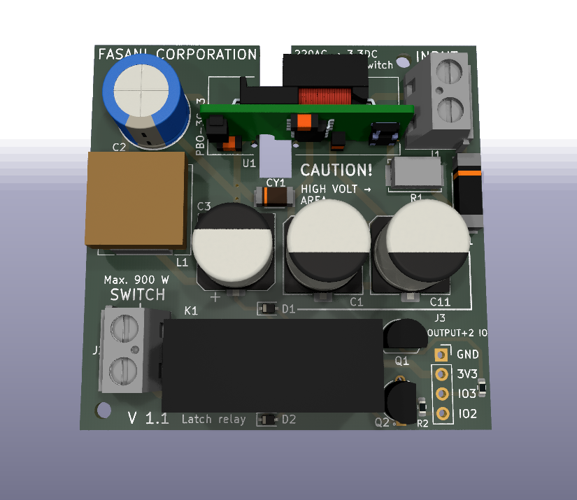

# Bistable-smart-switch

This is a project that started with the idea to use small, and inexpensive, SPI epapers with touch. The ones that I've found available and met that criteria are produced by Good-Display in Dalian.
The idea is very simple: Use this bistable displays, or any others with very low consumption, to design a Switch that can replace a standard European one.
I know is a lot of technology to turn on the light and at some point I though that no-one will buy a digital switch for a spaceship.

**But it turns out that it sparked some interest since there are some interesting points that drive this:**

- **ESP32-C3** is also an unexpensive, single Core, RISC-V Espressif MCU with 4 MB flash and the usual BLE/ WiFi combination
- **Having touch and UX with a bistable display**, using our own component CalEPD and our own touch fork, gives us the freedom to be Code-light and make versatile examples that everyone can extend and collaborate
- **ESP-Rainmaker** is a possibility that we already tested, so you can also turn ON/OFF the light with their application

All that we have already but it was around different repositories, where you had to configure CMakeFiles to point it to the right example and more...
The goal of this repo is to put all this Switch ideas and code demos in a single place, make a WiKi with configuration tutorials and documentation. Just make it easy for the user to get started and build his first working Firmware in 10 minutes.

With the current hardware and demo examples what you can do is straight-forward. You can design a switch, since we provide a very basic example, and detect touch X & Y events. Based on that you can send signals to the Latch relay PCB and move the switch to the ON or OFF position.
But is your switch. You could draw something using GFX over. Soon we will add examples to load images from WiFi and other cool things. And Latch relay is low consumption, you just move it with a 50 ms signal, then it stays in that position.
It has no way to tell in what position is from outside but we know it since by default the ESP32 C3 moves it to OFF as the Firmware starts.

## The hardware

It consists in two PCBs and the display using C3 as Microcontroller:

1. **ESP32-C3 controller with touch**
2. **220AC to 3.3DC adapter with a Latch relay switch**. 54x54 mm so it fits in the small black box inside the wall Can be also a solid-state relay or you can design your own
3. **The 2.7" display** with touch [GDEY027T91-T](https://github.com/martinberlin/cale-idf/wiki/Good-Display-gdey027T91)

  

This is the touch panel that comes already on top of the display. Check the [GOODISPLAY product page](https://www.good-display.com/product/2.7-inch-touch-screen,-for-2.7-inch-e-paper-display-259.html) for specifications and datasheet.

More pictures and documentation will be added in the WiKi section, that is better to keep things organized and inter-linked than a single readme page.

## The code examples

1. [Getting started](main/switch/getting-started) a simple ON-OFF basic switch. No configuration required.

More will soon land here. For the moment they are in mother repository cale-idf that is an incredible mess where I develop the components and is full of examples, that I promised myself to reorganize, and I will probably never do.
Just be patient, life takes it's times, just like the hardware design part and examples.

